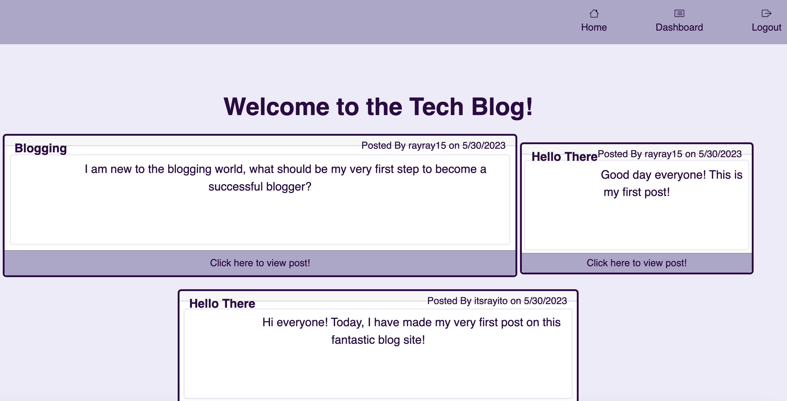

# MVC-Tech-Blog
# ORM-E-Commerce-Back-End
- [Description](#description)
- [Installation](#installation)
- [Usage](#usage)
- [Screenshot](#screenshot)
- [Contributions](#contributions)
- [License](#license)
- [Questions](#license)
- [Credits](#credits)
- [Heroku-Link](#Heroku-Link)

# Description
This app was built specifically to allow developers and others to publish their posts on a blog specifically made for users who are interested or work in the field enabling to interact and communicate with other developers. 

# Installation
To get the app, the user has to firt clone the repository by typing `git clone https://github.com/itsrayito/MVC-Tech-Blog.git`  
After cloning the repo to the local machine, the user then has to run the command `npm install` to install all necessary packages.  
The user then will be able to start the app by typing the command `npm start`  

# Usage
Node.js, Handlebars.js, Bootstrap, CSS, Sequelize, MySQL, Express.js, HTML  

# Screenshot
  
# Contributions
At this moment, there is no need for contributuons for this application. 

# License
   

# Questions
You can [email](rayito.aguirre94@gmail.com) me if there is any questions or comments that arise from this application. 
You can also get a hold of me through my [GitHub](https://github.com/itsrayito) account.

# Credits
This application was made entirely by Rayito Aguirre   
Lecture videos, class sessions, and helpful websites on MVC provided by Rice University Coding Bootcamp instructors in partnership with edX. 

# Heroku-Link
https://rays-tech-blog.herokuapp.com/

